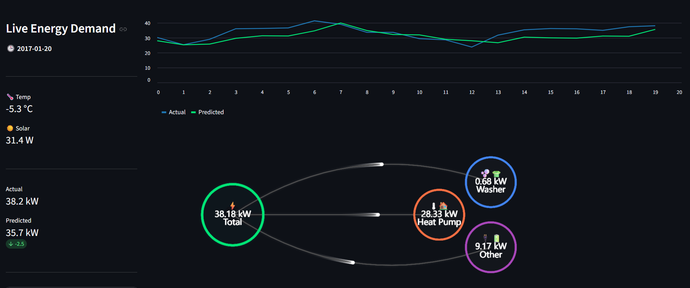
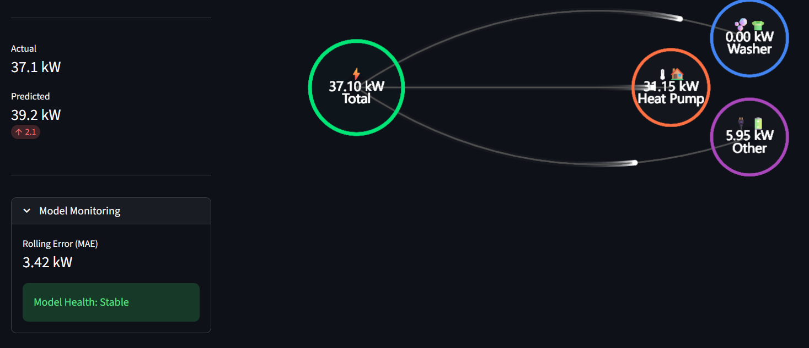
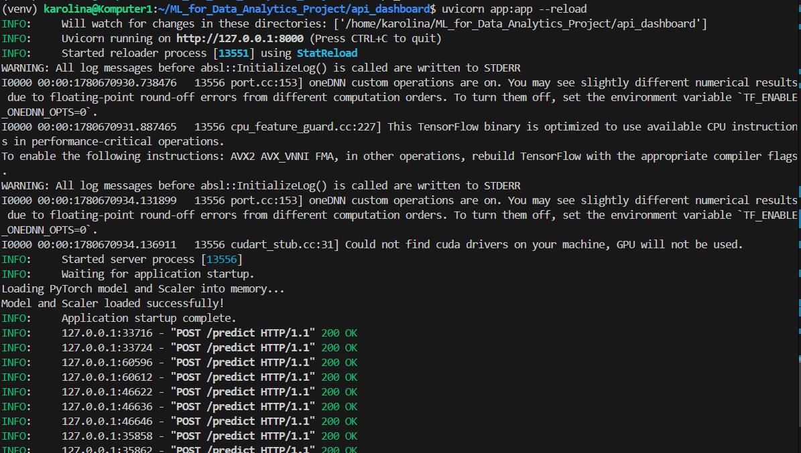
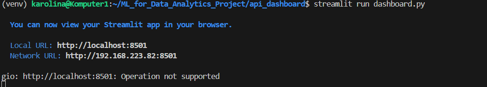

# Real-Time Energy Forecasting

This project features a decoupled MLOps architecture for real-time residential energy demand forecasting. It utilizes an LSTM model with Attention mechanisms, integrated with a live API and a dynamic streaming dashboard.

## System Architecture

1. **The Backend (FastAPI):** Loads the trained PyTorch `.pth` weights and the `scaler.joblib` into memory upon startup. It listens for incoming HTTP POST requests containing scaled sequences of data, runs the forward pass, and returns the inverse-scaled predictions.
2. **The Frontend (Streamlit):** It streams raw CSV test data, pushes it through the exact preprocessing pipeline used in training, and polls the FastAPI endpoint. It visualizes the results using dynamic line charts and a custom SCADA-style ECharts power-flow diagram.

### Weights & Biases (W&B) Integration
We use the trained model logged into W&B Artifacts:
* During training, the exact `MinMaxScaler` object and PyTorch weights (`model.pth`) are versioned and logged to W&B.
* In production, the backend and frontend download and initialize these exact artifacts. This ensures that the incoming production data is scaled using the exact  parameters the model learned during training.

### Basic Monitoring Strategy
To ensure the model does not silently degrade in production, the Streamlit dashboard includes a **Model Monitoring**. 
* The UI calculates the **Mean Absolute Error (MAE)** over a sliding 20-step window.
* If the MAE crosses a predefined threshold, it triggers a visual **Data Drift Warning**, alerting the user that the incoming data distribution may have shifted away from the training data.
---

## Execution Instructions

You will need two terminal windows.

### Step 1: Start the Inference API
Open your first terminal and navigate to the project directory:
```bash
# Activate your virtual environment
source venv/bin/activate

# Navigate to the deployment directory
cd api_dashboard

# Start the FastAPI server
uvicorn app:app --reload
```

Wait until the terminal reads `Model and Scaler loaded successfully!` and `Application startup complete`.

### Step 2: Start the Live Dashboard

Open a second, separate terminal window:
```bash
# Activate the same virtual environment
source venv/bin/activate

# Navigate to the deployment directory
cd api_dashboard

# Launch the Streamlit User Interface
streamlit run dashboard.py
```
### Step 3: Run the Stream

Your web browser will automatically open to http://localhost:8501.

Click the "Start Stream" button on the left sidebar.

Observe the terminal running FastAPI to see the live HTTP POST 200 requests being processed in real-time as the dashboard animations update.
The dashboard updates every 10s for the next day of data.
Dashboard should look like this:



And your terminals like this
- Terminal 1


- Terminal 2
